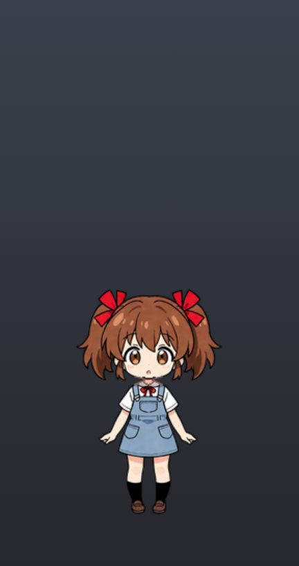
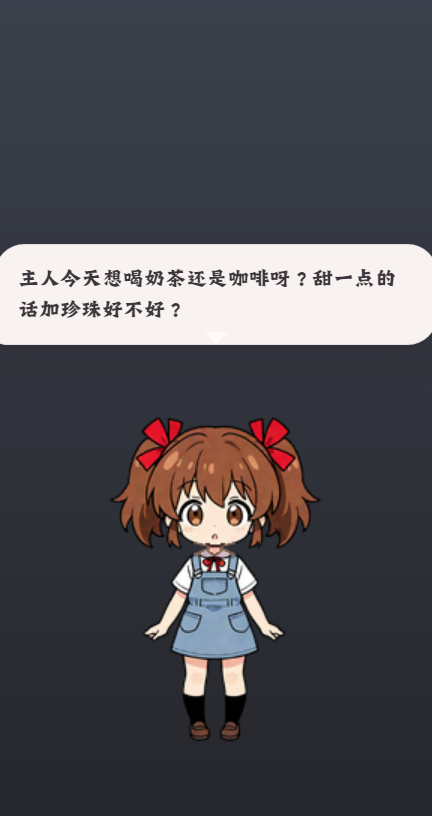

# 01 · 宠物主窗口

透明、无边框、常驻桌面的角色窗口。应用启动即创建，是唯一直接显示角色的界面。

> 图为文档棚拍加了深色渐变背板；实际窗口完全透明，只有角色本体可见。

## 窗口属性（`app/main/pet-window.js` `createPetWindow`）

- 透明、无边框、不可缩放、不进任务栏、无阴影
- 置顶级别 `screen-saver`（可被设置「始终置顶」关闭）
- 出生位置：主屏工作区右下角往内 40px
- **内容尺寸公式**：宽 = `包.size.width + 32`，高 = `包.size.height + 32 + 16 + 240`
  （240px 是常驻气泡槽，即使没气泡也预留——避免气泡弹出时改窗口尺寸引发闪烁）
  示例：小杏/小鲸 256×256 → 窗口 288×544
- 换包 / 导入包后窗口底部（角色脚）保持不动，向上长个

## 界面元素（`app/renderer/index.html`）

| 元素 | 显示内容 |
|--|--|
| `#stage` / `#puppet` | 角色精灵，双 `` 双缓冲切帧（back buffer 解码完成才交换，透明窗不闪） |
| `#bubble` | 头顶气泡：圆角白底 + 小尾巴，长文自动换行，`max-width = max(160, 包宽+8)`，超过 200px 高可滚动 |
| `#listen-dot` | 右下角 10px 听录点：录音时亮起鲑鱼粉（#f19c86）脉冲光环；`prefers-reduced-motion` 时退化为常亮 |
| `#hit` | 透明点击层，覆盖角色区域 |

气泡显示时长：`min(16s, max(2.8s, 1.8s + 字数×70ms))`。

## 交互（`app/renderer/pet.js`）

| 操作 | 行为 |
|--|--|
| 悬停角色 | 在角色正下方弹出[对话输入坞](04-compose.md)的药丸预览（预热窗，无延迟、不抢焦点）；移开后延迟 400ms 自动收起 |
| 单击角色 | 播点击动作（从包的 clicks 目录随机，避免与上次重复；小杏为挥手/开心） |
| 双击角色 | 打开[对话输入坞](04-compose.md)展开态（500ms、4px 内判定，与单击互斥） |
| 按住并移出 4px | 进入拖动（对齐 Win32 `SM_CXDRAG` 语义）：角色上浮 14px、倾斜 7°、放大 1.06、加投影；松手回落 |
| 右键角色 | 在点击处弹[右键菜单](03-pet-menu.md) |
| 鼠标移到空白处 | 点击穿透（`setIgnoreMouseEvents(true, forward)`），指针落回角色恢复 |
| 输入坞展开时点击角色 | 输入坞关闭，这次点击仍正常触发单击动作（不拿点击去挡操作） |

## 自动行为（详见 [09](09-behaviors.md)）

- idle 循环播放（支持 pingpong 乒乓回放）；空闲 2.5–5s 随机眨眼 / 打盹
- 「自己过日子」开启时：加权随机 待机/转身/小动作/休息/游走，游走撞边自动转身
- 45 秒无交互自动贴到屏幕右侧（可关）；检测到全屏自动隐藏（可关）
- 首次启动连发三条教学气泡（点我/拖动/热键），只发一次

## 代码位置

- 窗口生命周期：`app/main/pet-window.js`（`createPetWindow` / `resizePetToPack` / `nudgePetWindow`）
- 帧播放与状态机：`app/renderer/pet.js`（`playState` / `showFrame` / `continueLife`）
- 行为决策纯函数：`app/lib/behavior.js`（Node 侧可被 `scripts/verify_behavior.js` 直接测）

---

对齐记录：2026-09-23 二轮实拍（`capture_docs_ui.js` pet 段；`verify_hover_live.ps1` 真实桌面七帧含热键语音红麦与展开态点击语义）；`verify_pet_display.js sample-human / xiao-jing` 通过（content ≥ pack.size、头顶/脚留边、行走帧 ≥6、朝向翻转、播放时帧序列确实在变）；`verify_chat_ui.js` 通过（悬停药丸/展开/范围外点击才关闭全链路）。
