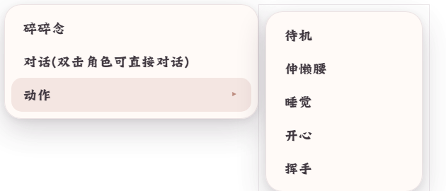

# 03 · 宠物右键菜单

右键点击宠物时，在**光标处**弹出的快捷菜单。透明无边框浮窗，420×180，自动夹取到主屏工作区内。

## 显示内容（`app/renderer/pet-menu.html`）

主菜单固定三项：

| 项 | 行为 |
|--|--|
| 碎碎念 | 让角色随口说几句。DeepSeek 已开且有 Key → 走模型生成；否则 → 从包内台词池随机一句 + 播 meow |
| 对话（双击角色可直接对话） | 打开[对话输入坞](04-compose.md)**展开态**（输入框直接就绪，跳过药丸预览） |
| 动作 ▸ | 悬停展开子菜单：「待机」+ 当前包全部动作（如图：待机/伸懒腰/睡觉/开心/挥手，文案取包内 label） |

## 交互细节

- **子菜单桥接**：主菜单与子面板之间无透明间隙（`#sub` 带 6px padding 桥接条），鼠标从「动作」滑进子菜单不会误关
- 悬停主菜单其他项 → 子菜单收起；鼠标完全离开菜单区域 → 子菜单收起
- 点击任意命令项 → 执行并**关闭整个菜单**
- 菜单窗口失焦 → 自动关闭（打开后 120ms 才开始武装失焦检测，防止打开瞬间的抢焦误触发）
- 菜单打开期间点击宠物 → 菜单关闭（宠物按下事件顺带关菜单）

## 触发与关闭

- 触发：右键宠物（拖动状态下右键不弹）
- 关闭：点击命令 / 失焦 / 打开对话浮窗
- 菜单已开时再右键宠物 → 先关旧菜单，在新点击位置重开

## 代码位置

- 主进程建窗与定位：`app/main/windows.js` `openPetMenu`（420×180，点击处夹取）
- 菜单 UI 与子菜单交互：`app/renderer/pet-menu.html` / `pet-menu.js`
- 动作数据来源：IPC `get-pet-menu` → `menuActions()`（包 `actions` + `states[label]` + 内置中文表）

---

对齐记录：2026-09-23 实拍（子菜单展开态，主菜单 min-width 226px）；`verify_chat_ui.js` 通过（菜单三项齐全、在点击处弹出、跨桥接条不收起、「初始位置」项不存在、点「对话」直接开展开态输入坞）。
