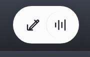
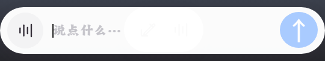
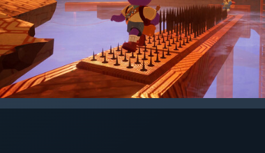

# 04 · 对话输入坞（Mini dock）

跟随宠物的迷你输入坞，是日常打字/说话的主要入口。**锚定在角色正下方**（水平居中，上沿 = 宠物窗底 − 34px，轻微叠住角色下摆），透明无边框，有两种形态：

| 形态 | 窗口尺寸 | 打开方式 | 关闭方式 |
|--|--|--|--|
| **药丸**（预览态） | 120×76 | 鼠标悬停角色即出现；语音周期中也会自动出现（红麦反馈） | 指针移开后延迟 400ms 自动关闭；语音结束后自动收起 |
| **展开输入**（正式态） | 360×68 | 双击角色 / 托盘左键 / 托盘「对话 / 输入」/ 右键菜单「对话」/ 点药丸的铅笔 | 点击坞以外的任何位置即关闭，这次点击照常落到原目标（角色、桌面、其它窗口）；或 Esc |

真实桌面悬停实拍（药丸贴在角色下摆，不抢焦点）：

## 药丸形态（`#quick-actions`）

悬停角色本体（`#hit` 的 `mouseenter`）即弹出，**无延迟**（坞窗口在宠物加载后就预热创建并隐藏，关闭后 120ms 自动重新预热）；`showInactive` 显示，**绝不抢占输入焦点**。

两个圆形图标按钮：

- **铅笔**（`#open-compose`，aria「输入消息」）：点击 → 展开为输入框并聚焦
- **麦克风**（`#quick-mic`，aria「按住说话」）：按下立刻进入监听，按钮随监听状态变红（快捷键进入监听同样变红）；松开若不足 0.5 秒则取消，不识别、不发送，并在角色身上飘字；满 0.5 秒松开才走识别并发送，按钮回到普通颜色

按钮变红只跟「正在听」同步，点击和快捷键一样。松开或识别中回到普通颜色。不足 0.5 秒会取消这次监听，不走识别和发送，提示走角色身上的飘字（`floater.js`），不是头顶对话气泡。热键发起语音时药丸仍会自动出现并在收听期间亮红麦（`showInactive`，不抢焦点），整个「听 → 识别」周期内坞被钉住（`composeVoicePin`），避免窗口被收掉后录音卡住；语音结束（`idle`）后自动解钉并按悬停规则收起。

药丸从角色下方 `dock-in` 动画弹出（0.18s 上浮现形）。

## 展开形态（`#compose-panel`）

显式打开（双击/托盘/菜单）时**直接就是展开态**（主进程发 `compose-expand`，跳过药丸）；从药丸点铅笔则以 `dockX` 为原点 `scaleX(0.24→1)` 平滑展开。

- 胶囊输入框 `#field`：左侧圆形麦克风按钮（`#field-mic`，aria「按住说话」，与药丸麦克风同一套按住说话 + 状态驱动变红逻辑），placeholder「说点什么…」，最长 500 字
- 右侧圆形 **↑** 发送按钮（`#send`）：输入为空时是淡蓝；去掉首尾空白后还有字则亮起（`#3d8bff`），提示可以发送。发出后输入被清空，按钮回到淡蓝
- `Enter` 发送（发送中禁用）；`Esc` 关闭窗口
- 提示行 `#hint` 目前 `display:none`：语音状态不显示文字，只靠麦克风变红 + 宠物右下角的[听录呼吸点](01-pet-window.md)反馈

## 跟随与定位规则（`app/main/compose.js`）

- 水平居中于宠物：`x = 宠物x + (宠物宽 − 坞宽)/2`；`y = 宠物窗底 − 34`；四向夹取在主屏工作区内
- 宠物被拖动 / 游走 / 换包改尺寸时，坞实时跟随（`move` 事件 + 锁定内容尺寸，避免 Windows 透明窗每次移动涨 1px）
- 主进程每次定位都下发 `compose-layout`（`dockX` = 角色中心相对坞左缘的 x），供药丸定位和展开动画原点使用；夹取导致偏移时药丸仍对准角色中心
- 形态切换即窗口换尺寸：药丸 120×76 ↔ 展开 360×68。**药丸态窗口只有药丸大**——透明窗口会吞点击，绝不能让 360px 的隐形矩形挡住角色脚部和桌面

## 关闭路径（状态机）

- **预览态（药丸）**：归悬停管。指针离开角色（`pet-compose-hover false`）或离开坞（`compose-hover false`）后启动 400ms 宽限计时（`COMPOSE_HOVER_CLOSE_MS`）；宽限内指针回到角色/坞上则取消；计时触发时再按一次光标物理位置兜底（在坞窗口内则不关）。预览态**不响应失焦**；语音周期（`composeVoicePin`）中悬停关闭整体被阻塞
- **展开态**：点击不在坞窗口里就关闭。不铺全屏遮罩，所以这次点击仍落到角色、桌面或其它窗口。置顶坞点在桌面上不会失焦，因此另有一个只读鼠标按键的观察（`pointer-watch.js`），看到按下且光标不在坞里就关。失焦路径同样只排除「点在坞上」。打开后 180ms 才武装，避免刚展开就被自己的那一下关掉；语音收听期间（`composeVoicePin`）不因失焦或这次观察关掉；`Esc`；托盘/IPC 主动关闭
- **宠物被隐藏**（托盘隐藏 / 勿扰热键 `Ctrl+Shift+H` / 检测到全屏）→ 坞一并关闭
- 展开态下点击角色：坞关闭，这一下仍然是角色自己的单击（不把点击吞掉只用来关窗）
- **持有语音的窗口被销毁**（如按住说话时窗口被关）→ 主进程安全网 `unstickHoldVoice` 主动结束录音，听录红点不会卡死

## 悬停预览期间宠物会暂停生命流

药丸出现即 `compose-flag=true`：宠物停止游走/随机动作并保持 idle——避免你伸手点药丸时宠物自己走开把坞带走。关闭后 1.6s 恢复生命流。

## 发送后发生什么

文本进 `agent.runAgentTurn`（详见 [09](09-behaviors.md)）：宠物先冒「正在想…」气泡；回复以**头顶气泡**显示在宠物上；若[聊天记录窗口](05-chat-history.md)开着，对话同步出现在那里。

## 代码位置

- 建窗 / 预热 / 跟随 / 悬停关闭 / 失焦关闭：`app/main/compose.js`；不拦截的按下观察：`app/main/pointer-watch.js`；语音状态广播：`app/main/voice.js`
- UI 逻辑：`app/renderer/compose.js` 与 `hold-talk.js`（按下即听、不足 0.5 秒取消、松开发送）；飘字：`app/renderer/floater.js`
- 样式：`app/renderer/compose.html`（`#quick-actions` 药丸、`#compose-panel` 胶囊输入）
- 旧版九宫格切图素材（`app/renderer/ui/*-9slice.png` + `scripts/bake_nine_slice.py`）自 Mini 坞改版后**已不再被引用**，保留备查

---

对齐记录：2026-09-23 二轮实拍（`capture_docs_ui.js` compose 段双态截图 + `verify_hover_live.ps1` 真实桌面七帧：悬停出现/停留保持/离开关闭/热键语音红麦药丸/语音结束自动收起/铅笔展开后点宠物不关/点桌面才关，全程无抢焦）；`verify_chat_ui.js` 通过（菜单/双击打开即展开态、360×68 锚定角色正下方、药丸 120×76 悬停预览、400ms 离开宽限、展开态光标在宠物内失焦不关/在外才关、按住说话漂移 700ms 钉住不关、热键语音无悬停出红麦药丸且不收焦点、语音结束自动收起、跟随宠物、聊天记录窗不跟随）。
