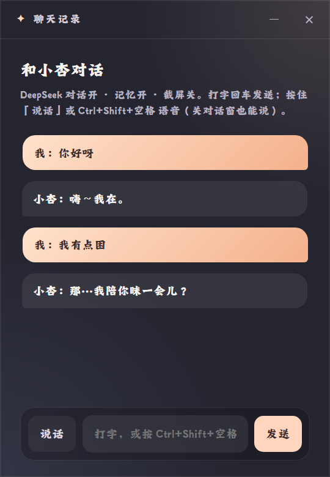

# 05 · 聊天记录窗口

独立的对话窗口，位置自己定、**不跟随宠物**。默认 360×520（最小 320×400），本次运行内记住上次位置。

## 显示内容（`app/renderer/chat.html` + `chat.js`）

自上而下：

1. **标题栏**：「聊天记录」+ 最小化 / 关闭按钮（36px 高，可拖动窗口；`Esc` 也可关）
2. **对话对象行**：「和小杏对话」（随当前角色显示名变化）
3. **状态提示行**：按当前设置拼接，例如
   `DeepSeek 对话开 · 记忆开 · 截屏关。打字回车发送；按住「说话」或 Ctrl+Shift+空格 语音（关对话窗也能说）。`
   —— DeepSeek 关时显示「本地规则（DeepSeek 关）」；保存设置后实时更新
4. **消息流**：
   - 用户消息靠右、灰色：`我：<内容>`
   - 角色消息靠左：`<角色名>：<内容>`
   - 系统小字居中（meta 行）：「正在想…」、「来源：local / local-fallback」、「回退本地（<错误>）」、「已看过屏幕（截屏感知）」
   - 首次打开且无记录时，先发一条角色问候语
5. **底栏**：`说话` 按钮（按住说话；键盘聚焦时 Space/Enter 开始/结束）+ 输入框（placeholder 随语音热键：「打字，或按 Ctrl+Shift+空格 说话」）+ `发送`

## 数据来源与持久化

- 打开时加载当前角色最近 **20 条**记录（`%APPDATA%\…\chats\<packId>.json`）
- 用户发言与角色回复都会落盘；超出 20 条裁掉最旧的
- 从[对话输入浮窗](04-compose.md)、语音、碎碎念产生的对话也会实时同步进本窗口（若开着）

## 语音状态

语音进行中按钮文案变化：「正在听…」→「识别中…」→「按住说话」。语音识别出的文字先以 `我：<识别文本>` 上屏，回复随后。

## 触发与关闭

- 触发：托盘「聊天记录…」
- 关闭：标题栏 × / `Esc`；关闭只关窗口，不影响宠物与语音

## 代码位置

- 建窗与位置记忆：`app/main/windows.js` `openChatWindow`（`lastChatBounds`，仅运行期内）
- 记录读写：`app/lib/chat-log.js`（`slice(-20)`）
- UI 逻辑：`app/renderer/chat.js`

---

对齐记录：2026-09-22 实拍（含 4 条种子对话 + DeepSeek 开 / 记忆开 / 截屏关状态行）。
