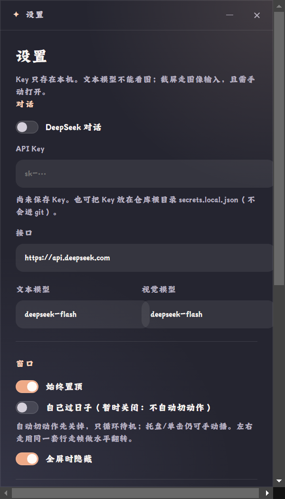

# 06 · 设置窗口

深色对话框，400×700（最小 360×520）。标题栏「设置」+ 最小化/关闭，`Esc` 可关。

> 图为「尚未保存 Key」的初始状态实拍。

顶部说明：`Key 只存在本机。文本模型不能看图；截屏走图像输入，且需手动打开。`

## 「对话」区

| 控件 | 说明 | 默认 |
|--|--|--|
| DeepSeek 对话（开关） | 关掉则完全走角色包本地台词 | 关 |
| API Key（密码框） | placeholder `sk-…`；**留空保存不覆盖已存 Key**；下方提示行显示掩码「已保存 Key：<前 5 位>…<后 4 位>」或「尚未保存 Key。也可把 Key 放在仓库根目录 secrets.local.json（不会进 git）。」 | 空 |
| 接口 | Base URL | `https://api.deepseek.com` |
| 文本模型 | | `deepseek-flash` |
| 视觉模型 | 截屏感知用，必须是图像输入型号 | `deepseek-flash` |

## 「窗口」区

| 控件 | 说明 | 默认 |
|--|--|--|
| 始终置顶 | 宠物窗口置顶（screen-saver 级） | 开 |
| 自己过日子（暂时关闭：不自动切动作） | 生命流总开关；下方说明：「自动切动作先关掉，只循环待机；托盘/单击仍可手动播。左右走用同一套行走帧做水平翻转。」 | 关 |
| 全屏时隐藏 | 每 3 秒检测主屏全屏态，全屏则藏宠物，退出全屏恢复 | 开 |

## 「快捷键」区

- **隐藏 / 显示**：默认 `Ctrl+Shift+H`
- **开始 / 结束语音**：默认 `Ctrl+Shift+空格`（当前机器实拍为 `` Ctrl + ` ``）
- 输入方式：点击输入框 → 直接按组合键捕获；`Esc` 取消；`Backspace/Delete` 或「清除」按钮清空
- 规则：全局生效、至少一个修饰键（F1–F24 可单用）、**两项不能相同**（保存时拦截：「隐藏和语音不能用同一组快捷键。」）

## 「记忆」区

| 控件 | 说明 | 默认 |
|--|--|--|
| 长期记忆 | 开后模型可用 `remember`/`forget` 工具，按角色存本机 | 关 |
| 截屏感知 | 开后模型可 `glance_screen`；图像发往视觉模型接口 | 关 |

## 底部按钮

| 按钮 | 行为 |
|--|--|
| 保存（主色） | 写入 `settings.json`；热键**立即重新注册**；状态行显示「已保存。快捷键立即生效。」；若热键被占用则提示「已保存，但<语音、隐藏/显示>快捷键注册失败（可能被系统或其他软件占用）。」（按实际失败项拼接） |
| 清空记忆 | 清空**当前角色**的长期记忆，状态行「当前角色记忆已清空。」 |
| 导入 .dpet | 等同托盘「导入角色包…」 |
| 导入文件夹 | 选含 `pack.json` 的文件夹，复制进 `imported-packs/` 并切换 |
| 环境依赖 | 打开[环境依赖窗口](07-setup-deps.md) |

## 代码位置

- 字段与持久化：`app/lib/settings.js`（`publicSettings` 负责 Key 脱敏下发）
- 热键解析/展示：`app/lib/hotkeys.js`
- UI：`app/renderer/settings.html` / `settings.js`

---

对齐记录：2026-09-22 实拍；`verify_settings_hotkey_ui.js` 通过（热键捕获 Ctrl+Shift+H → `CommandOrControl+Shift+H`、显示格式化、乐米石朗体已加载）。
