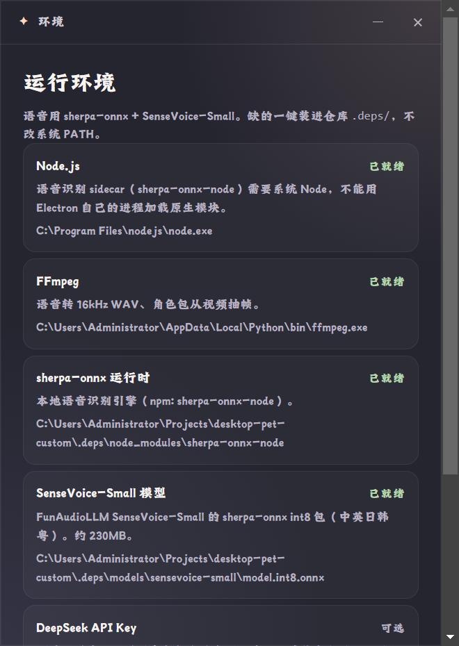

# 07 · 环境依赖窗口

深色对话框，440×620（最小 380×480）。标题栏「环境」。缺必装依赖时**每次启动自动弹出**；也可从托盘「环境依赖…」或设置里手动打开。

> 图为本机**真实检测结果**实拍（`deps.scan`）。

顶部说明：`语音用 sherpa-onnx + SenseVoice-Small。缺的一键装进仓库 .deps/，不改系统 PATH。`

## 依赖清单（逐项）

| 项 | 标签 | 说明 | 安装方式 |
|--|--|--|--|
| Node.js | 必装 | 语音识别 sidecar 需要系统 Node（sherpa-onnx-node 原生模块不能在 Electron 进程里加载） | 下载便携 Node 22 解压进 `.deps\node\` |
| FFmpeg | 必装 | 语音转 16kHz WAV；角色包从视频抽帧 | `npm i ffmpeg-static` 后复制到 `.deps\ffmpeg\` |
| sherpa-onnx 运行时 | 必装 | 本地语音识别引擎（`sherpa-onnx-node@1.13.4`） | npm 装进 `.deps\node_modules\` |
| SenseVoice-Small 模型 | 必装 | 中英日韩粤 int8 包，约 230MB | hf-mirror / HuggingFace / GitHub Release 多源下载 |
| DeepSeek API Key | 可选 | 没有 Key 时用本地台词；有 Key 才能自由聊、工具驱动动画、截屏感知 | 不可一键装（引导去设置页粘贴） |

每行显示：名称 + 标签（**已就绪**绿 / **缺失**红 / **可选**）+ 两行灰色明细（用途说明 + 探测到的路径或未安装原因）。

图中实拍状态（2026-09-23 晚重拍）：Node.js 已就绪（`C:\Program Files\nodejs\node.exe`）、FFmpeg 已就绪（命中本机候选路径）、sherpa-onnx 已就绪（`.deps\node_modules\sherpa-onnx-node`）、SenseVoice-Small 已就绪（`.deps\models\sensevoice-small\model.int8.onnx`）、DeepSeek Key 已配置（可选）。历史：09-22 前的旧图里 sherpa-onnx 与 SenseVoice-Small 显示缺失——那是装依赖之前的实拍。

## 按钮

| 按钮 | 行为 |
|--|--|
| 一键安装缺失项（N） | 逐个安装缺失的必装项；全齐时变为「依赖已齐」并禁用；安装中底部日志滚动显示百分比 |
| 重新检测 | 重新扫描并刷新列表与日志 |
| 继续 | 关闭窗口；若必装项已齐则后台预热语音识别子进程 |

底部日志区文案：缺项时「还缺：sherpa-onnx 运行时、SenseVoice-Small 模型」；全齐时（当前实拍）「必装依赖已就绪，可以继续。」

## 代码位置

- 可扩展依赖目录：`app/lib/deps/index.js`（新增依赖 = 在 `items/` 加一个文件调 `registerDep()`）
- 各依赖检测/安装：`app/lib/deps/items/{node,ffmpeg,voice,deepseek}.js`
- UI：`app/renderer/setup.html` / `setup.js`

---

对齐记录：2026-09-22 实拍（真实 `deps.scan`，非 stub）；真实启动桌面图可见「缺依赖时自动弹出」行为。2026-09-23 晚重拍：依赖全绿（`scripts/verify_deps_scan.js` 实测 missing=[]），启动不再自动弹窗；`live_desktop.png` 已同步更新。
