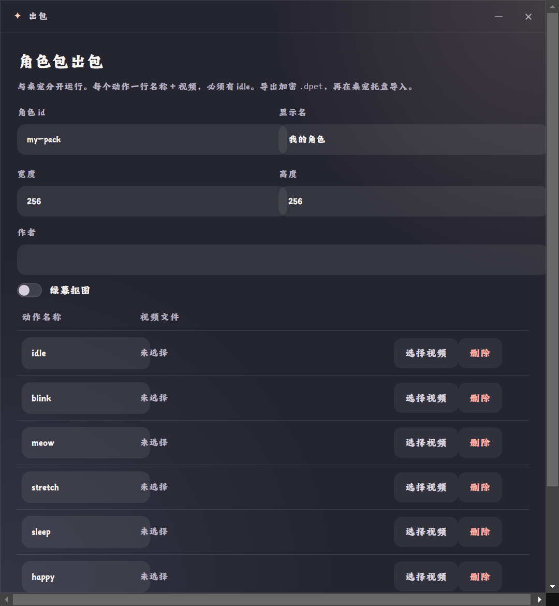

# 08 · 角色包出包工具（独立进程）

作者侧工具：**与桌宠完全分开的 Electron 进程**（自己的 `app/packer/main.js`，userData 独立为 `desktop-pet-packer`），打开它不会启动桌宠。720×780（最小 560×560），标题栏「出包」。

启动方式：双击仓库根 `run-packer.cmd`；或 `node scripts/run-packer.js`；或 `cd app && npm run packer`。首次运行会在桌面创建「桌宠出包.lnk」。

## 显示内容（`app/packer/index.html` + `ui.js`）

顶部说明：`与桌宠分开运行。每个动作一行名称 + 视频，必须有 idle。导出加密 .dpet，再在桌宠托盘导入。`

| 控件 | 默认/说明 |
|--|--|
| 角色 id | `my-pack`（导出时被规范化：小写、非法字符转 `-`） |
| 显示名 | `我的角色` |
| 宽度 / 高度 | `256` / `256`（帧画布，最小 32） |
| 作者 | 空 |
| 绿幕抠图（开关） | 开后抽帧时按 `0x00FF00` colorkey 去绿幕（容差 0.30/边缘 0.12） |
| 动作表 | 默认 6 行：`idle` `blink` `meow` `stretch` `sleep` `happy`；每行 = 动作名输入框 + 视频路径（未选择时显示「未选择」）+「选择视频」「删除」 |
| 添加动作 | 追加一个空行 |
| 导出加密包（主色） | 见下方流程 |
| 日志行 | 初始「准备就绪。本工具不启动桌宠。」；过程中滚动进度 |

## 导出流程与校验

1. 校验：**必须有动作名为 `idle` 且已选视频的行**，否则报「错误：必须有名为 idle 且已选视频的一行。」
2. 选保存路径（默认 `<id>.dpet`）
3. 每个动作：FFmpeg 抽帧 → 绿幕抠图（可选）→ lanczos 等比缩放 + 透明补齐到设定画布 → 帧数多于此 90 帧时**均匀抽稀** → 探测视频 fps 并夹在 4–24
4. loop/pingpong 默认规则：`idle/sleep/blink` 默认循环；`idle/sleep` 默认乒乓（帧数 >2 时）；动作中文名自动写入 label（待机/眨眼/睡觉/伸懒腰/挥手/开心/走路/跑步）
5. 生成 `pack.json` → 加密打包为 `.dpet`（AES-256-GCM + HKDF，gzip 压缩；格式见 `app/lib/dpet.js` 头注释——**分发封装，不是 DRM**）
6. 日志显示「完成：<路径>」换行「动作：<id 列表>」；临时目录自动清理

## 使用衔接

导出的 `.dpet` 在桌宠托盘「导入角色包…」导入（解密进 `pack-cache`，本体存 `imported-packs`）。

## 代码位置

- 进程与对话框：`app/packer/main.js`；桥接：`app/packer/preload.js`（`packerApi`）
- 抽帧：`app/lib/ffmpeg-frames.js`；组包：`app/lib/pack-build.js`；加密：`app/lib/dpet.js`
- 出包素材的 upstream 管线（绿幕视频怎么来）：`docs/author-pipeline.md`、`comfy/`

---

对齐记录：2026-09-22 实拍；`verify_packer_ui.js`（窗口渲染、6 行默认动作、按钮齐全）与 `verify_packer_roundtrip.js`（打包→解包往返一致）均通过。
