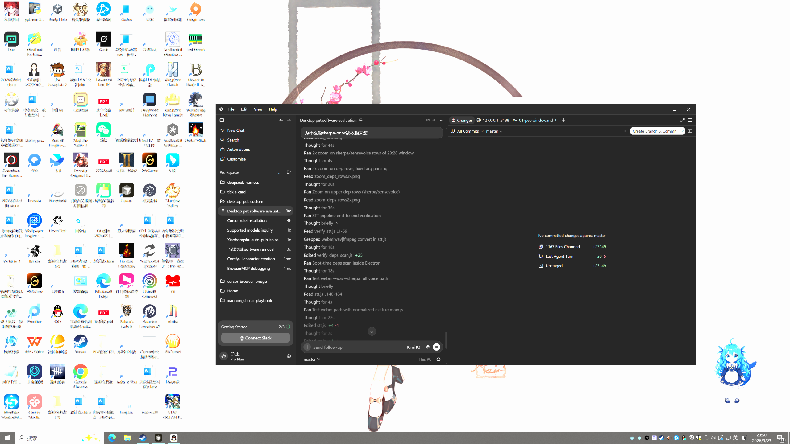

# 功能文档（与当前代码对齐）

本套文档逐界面描述桌宠 **当前真实行为**，精细到每个窗口显示什么。口径以 `app/` 代码为准，截图全部实拍（拍摄日期见各篇末尾）。

## 产品定位（BRIEF.md）

开源可换角桌宠 + 账号发放角色包。DeepSeek 只管文本对话与工具调用；视觉另接图像输入模型。

| 阶段 | 内容 | 默认 |
|--|--|--|
| P0 | 置顶桌宠、拖动/点击、换包、≥2 示例包、导入 `.dpet` | 开 |
| P1 | 本地长期记忆 + DeepSeek 文本 + 白名单工具 + sherpa-onnx/SenseVoice-Small 本地语音 | 记忆关；DeepSeek 关 |
| P2 | 截屏感知（图像输入模型） | **关**（须手动打开） |

## 界面地图（8 个界面）

| # | 界面 | 触发方式 | 尺寸（宽×高） | 源文件 | 文档 |
|--|--|--|--|--|--|
| 1 | 宠物主窗口（透明常驻） | 启动即开 | `(包宽+32) × (包高+288)`，小杏为 288×544 | `app/renderer/index.html` + `pet.js` | [01](01-pet-window.md) |
| 2 | 托盘图标 + 原生右键菜单 | 常驻系统托盘 | —（OS 原生） | `app/main/tray.js` | [02](02-tray.md) |
| 3 | 宠物右键菜单 | 右键点击宠物 | 420×180，在点击处弹出 | `app/renderer/pet-menu.html` | [03](03-pet-menu.md) |
| 4 | 对话输入坞（Mini dock） | 悬停宠物 → 药丸预览；双击 / 托盘左键 / 托盘「对话 / 输入」/ 菜单「对话」→ 展开输入 | 药丸 120×76 / 展开 360×68，锚定角色正下方 | `app/renderer/compose.html` | [04](04-compose.md) |
| 5 | 聊天记录窗口 | 托盘「聊天记录…」 | 默认 360×520（最小 320×400），位置本次运行内记忆 | `app/renderer/chat.html` | [05](05-chat-history.md) |
| 6 | 设置窗口 | 托盘「设置…」 | 400×700（最小 360×520） | `app/renderer/settings.html` | [06](06-settings.md) |
| 7 | 环境依赖窗口 | 缺必装依赖时启动自动弹出；或托盘「环境依赖…」 | 440×620（最小 380×480） | `app/renderer/setup.html` | [07](07-setup-deps.md) |
| 8 | 角色包出包工具（**独立进程**） | `run-packer.cmd` / `node scripts/run-packer.js` / `npm run packer` | 720×780（最小 560×560） | `app/packer/index.html` | [08](08-packer.md) |

行为与自动化（生命流、AI 工具、记忆、语音、截屏感知、热键、新手引导）见 [09](09-behaviors.md)。

真实启动后的桌面实拍：



> 当前机器状态（2026-09-23 晚实拍）：右下角为当前角色「小鲸」；必装依赖已全齐（sherpa-onnx + SenseVoice-Small 于 09-10 装进 `.deps\`），启动不再弹「环境依赖」窗口；桌面左侧为首次启动自动创建的「桌宠」快捷方式。

## 数据存储（全部本机）

| 位置 | 内容 |
|--|--|
| `%APPDATA%\desktop-pet-custom\desktop-pet-custom\settings.json` | 全部设置，**含明文 API Key**（注意是两层目录） |
| `…\chats\<packId>.json` | 聊天记录，每角色只留**最近 20 条** |
| `…\memory\<packId>.json` | 长期记忆：facts ≤80 条、summary ≤1200 字 |
| `…\imported-packs\` | 导入的 `.dpet` 副本 / 文件夹包 |
| `…\pack-cache\` | `.dpet` 解密缓存（按文件名+mtime+大小做 key） |
| 仓库根 `secrets.local.json` | 备选 Key 来源（已 gitignore） |
| 仓库 `.deps\` | 一键安装的依赖：便携 Node、FFmpeg、sherpa-onnx-node、SenseVoice-Small 模型 |

API Key 读取优先级：设置页保存的 userData > 环境变量 `DEEPSEEK_API_KEY` > `secrets.local.json`。

## 截图与文档的再生方法（维护入口）

```powershell
# 8 个界面的棚拍截图（每界面独立 Electron 进程，stub IPC + 真实 HTML/CSS/JS；
# 依赖窗口为真实 deps.scan 结果）：
cd C:\Users\Administrator\Projects\desktop-pet-custom
node scripts\capture_docs_ui.js

# 真实启动 app/main.js + 8 秒后截全桌面（证明当前能跑）：
app\node_modules\electron\dist\electron.exe scripts\capture_docs_live.js
```

行为断言（改交互后必跑）：

```powershell
node scripts\verify_behavior.js; node scripts\verify_dialogue.js; node scripts\verify_tools.js
node scripts\verify_dpet.js; node scripts\verify_memory.js; node scripts\verify_hotkeys.js
node scripts\verify_pointer.js; node scripts\check-packs.js; node scripts\verify_packer_roundtrip.js
app\node_modules\electron\dist\electron.exe scripts\verify_pet_display.js sample-human
app\node_modules\electron\dist\electron.exe scripts\verify_pet_display.js xiao-jing
app\node_modules\electron\dist\electron.exe scripts\verify_chat_ui.js
app\node_modules\electron\dist\electron.exe scripts\verify_settings_hotkey_ui.js
app\node_modules\electron\dist\electron.exe scripts\verify_packer_ui.js

# 真实桌面交互链路（预热秒开 / 不抢焦点 / 400ms 离开宽限 / 热键语音红麦药丸 /
# 语音结束自动收起 / 展开态点宠物不关、点桌面才关）：
powershell -ExecutionPolicy Bypass -File scripts\verify_hover_live.ps1
```

## 已知限制（如实）

- **仅 Windows 验证过**；所有布局按主显示器计算，多显示器未适配。
- 无安装包：用户需 Node.js 18+ 跑源码（`cd app && npm install && npm start`）。
- 无单实例锁，重复启动会开多个宠物。
- `.dpet` 是分发封装（防随手解压），**不是 DRM**，密钥派生串就在开源代码里。
- 缺必装依赖（sherpa-onnx / SenseVoice）时，**每次启动都会自动弹「环境依赖」窗口**。
- 托盘菜单是 OS 原生菜单，无法用 `capturePage` 截图；[02](02-tray.md) 按 `main.js` 声明式模板逐条记录。

---

对齐记录：2026-09-23 全部界面二轮实拍（输入坞 Mini dock 双态；展开态左侧「+」改为真实麦克风按钮）+ 校验脚本通过（纯逻辑 9 个 + Electron UI 7 个；`verify_walk_move` 对真实光标位置敏感，需把光标挪离测试窗口）+ `verify_hover_live.ps1` 真实桌面七帧验证（悬停三帧 + 热键语音红麦/自动收起 + 展开态点击语义）。自动停靠特性已整体移除（代码 / 设置项 / 设置页开关）。
